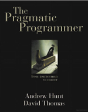
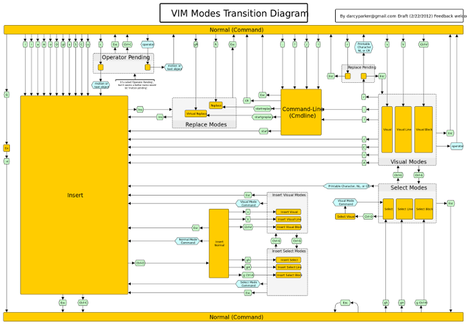

title: Taller de editores
author:
  name: Carlos López
  twitter: morrizon
  url: https://github.com/morrizon
output: editores.html
controls: true

--
# Workshop 001 Editores
## DevOps Las Palmas
--
### The Pragmatic Programmer
> Tip 22
>
> Use a Single Editor Well
##[](https://pragprog.com/the-pragmatic-programmer/extracts/tips)
--
### Características deseables de un editor
* Configurable
* Extensible
* Programable
--
### Características de programación
* Syntax highlighting
* Auto-completado
* Auto-indentación
* Código inicial (boiler plate)
* Ayuda en línea
* IDE (compilación, tests, etc)
--
### Editores
* Vim
* Emacs
* Sublime Text
* *Eclipse/IntelliJIDEA* (IDEs)
--
### ¿Por qué Vim?
* Ubicuo
* Ideal para línea de órdenes
* Afín a cultura DevOps
* Cumple las premisas de Power Editing (Pragmatic Programmer)
--
### Intro Vim
* Historia
* Modos
* Movimientos
* Órdenes
--
### Historia I
* 1976 Bill Joy desarrolla Vi como mejora a ex
* 1991 Bram Moolenaar desarrolla Vim ("Vi iMitated"/"Vi iMproved")
* 1998 Versión 5.0 (syntax highlighting, basic scripting)
--
### Historia II
* 2006 Versión 7.0 (spell check, tabs, autocompletion)
* 2013 Versión 7.4 (nuevo motor regex)
* [Why vim uses hjkl as arrow keys](http://www.catonmat.net/blog/why-vim-uses-hjkl-as-arrow-keys/)
--
### Modos I
* Normal
* Insert
* Visual
--
### Modos II
Diagrama modos simplificado
--
### Modos III
[](https://rawgit.com/darcyparker/1886716/raw/eab57dfe784f016085251771d65a75a471ca22d4/vimModeStateDiagram.svg)
--
### Movimientos I
```
h # izquierda
j # abajo
k # arriba
l # derecha
```
--
### Movimientos II
```
^,0 # principio de línea
$ # fin de línea
gg # Arriba del todo
G # abajo del todo
```
--
### Movimientos III
```
w,W # siguiente palabra, Palabra
b,B # anterior palabra, Palabra
e,E # siguiente fin de palabra, Palabra
ge,gE # anterior fin de palabra, Palabra
```
--
### Movimientos IV
```
f{char} # siguiente carácter {char} en la línea
F{char} # anterior carácter {char} en la línea
t{char} # antes de siguiente carácter {char} en la línea
T{char} # antes de anterior carácter {char} en la línea
```
--
### Movimientos V
```
<CTRL-f> # avance página
<CTRL-b> # retrocede página
{num}G # va a la línea {num}
{,} # avanza, retrocede párrafo
```
--
### Y aun hay más
* Búsquedas y sustituciones
* text objects
* Plugins
* Vimscript
--
### Fuentes de interés
* ```:help usr```
* [Vim.org](http://www.vim.org/)
* [Drew Neils vimcasts](http://vimcasts.org/)
* [ViEmu cheet sheet and tutorial](http://www.viemu.com/a_vi_vim_graphical_cheat_sheet_tutorial.html)
--
### Aprender divirtiéndose
* [Vim Adventures](http://vim-adventures.com/)
* [VimGolf](http://www.vimgolf.com/)
--
### Ejercicio 0
```
vimtutor
```
--
### Ejercicio 1
* Escribir "Hello World" insertando como máximo un carácter en modo inserción de cada vez.
* No repetir acciones de cambio de modo excepto a modo normal. Usar a,A,i,I,r,R,x,p.
--
### Ejercicio 2
* Escribir las 10 primeras líneas tal que la primera línea tenga 1, la segunda 2, etc.
* Mínimo número de pulsaciones (como en vimgolf).
--
### Ejercicio 3
* Editar Vagrantfile.
* Eliminar todos los comentarios excepto la configuración de red.
* Modificar la configuración de red.
### Ejercicio 4
* Script para renombrar ficheros *.src con su correspondiente *.avi.
--
### Ejercicio 5
* Refactoring.
* Substitución en varios ficheros.
--
### Ejercicio 6
* Autoidentar código puppet.
* Plugin https://github.com/rodjek/vim-puppet
* Instalar vía pathogen https://github.com/tpope/vim-pathogen
--
### Ejercicio 7
* Preparar entorno de desarrollo TDD para PHP.
* Realizar un programa de prueba.
* Plugins https://github.com/joonty/vim-phpqa y https://github.com/joonty/vim-phpunitqf
* Instalar vía Vunddle https://github.com/gmarik/Vundle.vim
